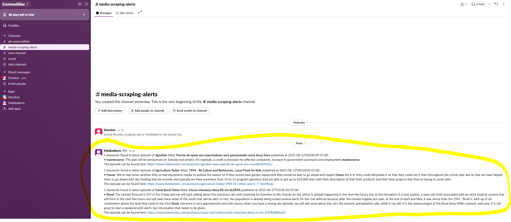
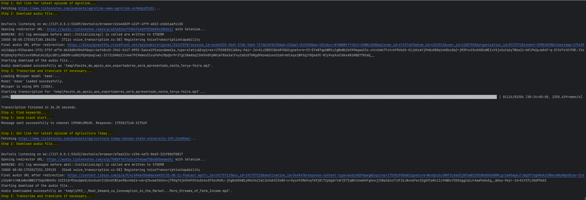

# Introduction

Media-scrape provides a solution for finding references to keywords in podcasts within minutes of their release.
Add your favorite podcasts and keywords to the config, connect your slack channel and expect alerts to come in! 
As found here it is configured to track 3 podcasts covering agriculture looking for keywords such as "flood", "drought" or "strike".
An example of the generated alerts can be found below.

# Setup

1. Before running:
   1. Set `SLACK_BOT_TOKEN` to your environment. Instructions for slack bot configuration [found here](https://api.slack.com/tutorials/tracks/getting-a-token).
   2. Set `SLACK_CHANNEL_ID`, the ID of the slack channel where you would like the alerts to be set in `config.py` or in your environment.
   3. Install all required packages: `pip install -r requirements.txt`

2. Further possible configurations in `config.py`
   1. `SOURCES` Your desired sources (currently supports any podcast on "https://www.listennotes.com/")
   2. `KEYWORDS` The keywords you would like to trigger alerts
   3. `TIMOUT_MS` Interval in milliseconds between checks for the latest podcast/article available (default 15 minutes).

# Runtime

**Startup**

Run by calling `python main.py`

The code will iterate through the provided sources, download the latest episode (translate to english where necessary), 
search for the presence of the set keywords and alert to their presence in your chosen slack channel.

**What would I expect to see in slack?**

**What would I expect to see the in the console?**

# How it works

